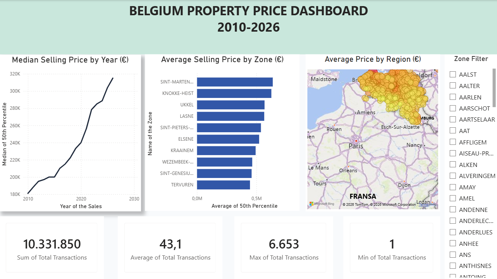

# 🇧🇪 Belgium Property Sales Analytics Pipeline

End-to-end modern data stack project analyzing Belgian real estate prices using BigQuery, dbt, and Power BI.

## Architecture & Tech Stack
* **Storage & Data Warehouse:** Google BigQuery
* **Data Transformation & Modeling:** dbt Cloud (Staging & Marts layers with automated generic tests)
* **Visualization:** Power BI Desktop

*  **Live dbt Data Catalog & Lineage:**  https://furkansuvatlar.github.io/belgium-real-estate-2010-2026-dbt/
*  **Power BI Dashboard Preview:** 

## Project Key Highlights
* Data cleaned and standardized across geographic levels (REFNIS codes).
* Data freshness and quality checked via `not_null` and `accepted_values` generic tests in dbt.
* Dimensional modeling applied to separate staging transformations from reporting marts (`fct_property_sales`).
